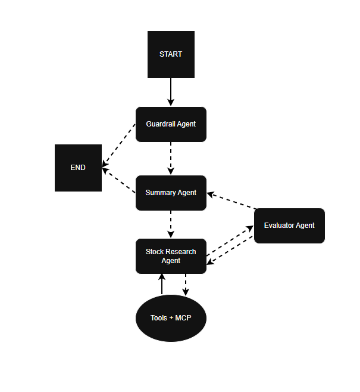

# 📈 stockAgent

**stockAgent** is an AI-powered stock analysis backend application written in Python.  
It implements a **multi-agent workflow** that validates user input, performs stock market research, evaluates analysis quality, and produces a final, well-formatted HTML report.

---

## 🧠 What Does the Agent Do?

The agent analyzes **1 to 5 publicly traded stocks** provided by the user and produces a **professional investment-style analysis** for each stock, including:

- Pros
- Cons
- Summary
- Sources used

If the input is invalid (too many stocks or unrelated to stocks), the agent stops early using a guardrail mechanism.

---

## 🔁 Agent Workflow (Graph)



## 🛠️ Technologies Used

### 🧠 AI / Agent Frameworks
- **LangChain** – used for building LLM-powered agents, prompt execution, and tool orchestration  
- **LangGraph** – used to model the agent workflow as a graph with explicit states and transitions
  - guardrail validation
  - iterative worker → evaluator loops
  - cost-aware stopping conditions
- **MCP (Multi-Component Process)**

---

### 🔗 LLM & Prompt Engineering
- **Prompt Engineering** – structured, role-based prompts with strict output schemas
- **Guardrails** – early termination rules for invalid or out-of-scope inputs
- **Evaluator Pattern** – automated quality control and retry feedback loop
- **HTML Output Generation** – LLM-generated, frontend-ready reports


## ⚙️ Installation (Local)

```bash
git clone https://github.com/kamilwilnicki/stockAgent.git
cd stockAgent
python -m venv .venv
source .venv/bin/activate
pip install -r requirements.txt
python app/main.py
